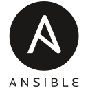

# 👋 Hello World! I'm Quentin - Student 🎓

I'm a student at *Ensemble Saint-luc (France)*.

## 💻 Skills & Technologies
From doing Batch file at 10yo, Visual Basic with Windows Forms at 13yo, I ended programing in many languages.

Here is a preview of some of my skills:

  
  
  
  
  
  
  
  
  
  
  
  

## 💻 Places to find me

---
**Disclaimer:** This README is a work in progress and reflects my ongoing learning journey.  Feedback and suggestions are always welcome!
